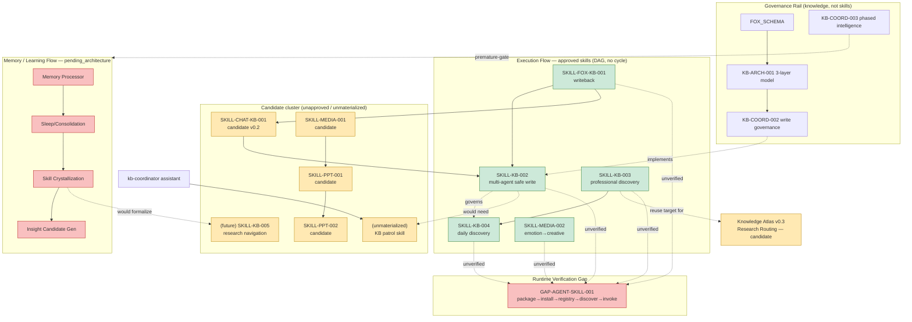

# FOX Capability / Skill Graph — Full System Dry Run v0

> **2026-09-16 execution update:** OWNER reviewed this dry run and explicitly authorized direct execution on 4 of the priority items below (Runtime verification, schedule/patrol-skill cleanup, promoting the 3 candidate skills, and assistant/plugin governance gaps). Those changes have since been written directly to the live FOX Knowledge Base on Google Drive (`KB-AGENT-CAP-002`, `KB-SCHED-001`, `SKILLS_INDEX.md`, `ASSISTANT_INDEX-助理登記表.md`, `OWNER_DECISIONS_INDEX.md`, `CHANGELOG.md`, plus new files `SKILL-KB-006-知識庫巡邏與交接審核.md` and promoted `SKILL-MEDIA-001`/`SKILL-PPT-001`/`SKILL-PPT-002`). This document below is left as the original analysis snapshot for the record; see `OWNER_DECISIONS_INDEX.md` in Drive for the current status of the remaining open items (engineering-management authority source, occupational-safety-system review checklist, and the plugin-duplicate confirmation, all still requiring OWNER's own judgment).

```yaml
mode: full_system_dry_run
google_drive_writeback: false
formal_skill_creation: false
formal_node_creation: false
formal_wiki_creation: false
goal_modification: false
schedule_modification: false
assistant_responsibility_modification: false
promotion: false
status: shadow_unverified
```

This is a **candidate / dry-run / analysis** document only. It does not modify `FOX_SCHEMA`, `INDEX`, `NODES_INDEX`, `SKILLS_INDEX`, `ASSISTANT_INDEX`, `KB-SCHED-001`, any `GOAL-*`, or any Google Drive file. All conclusions are `shadow_unverified` until OWNER reviews them. Nothing here counts as a second piece of evidence just because the model wrote it twice.

Evidence base: `INDEX.md`, `FOX_SCHEMA.md`, `INBOX_INDEX.md`, `SOURCES_INDEX.md`, `WIKI_INDEX.md`, `NODES_INDEX.md`, `SKILLS_INDEX.md`, `OUTPUTS_INDEX.md`, `OWNER_DECISIONS_INDEX.md`, `ASSISTANT_INDEX-助理登記表.md`, `KB-SCHED-001`, `KB-ARCH-001`, `KB-PKM-001/002`, `KB-COORD-001~005`, `KB-VISION-001`, `KB-WORK-001`, `NODE-GOV-001/002`, `NODE-DEC-001`, all 8 `SKILL-*` files, `GOAL-LIFE-001`, `GOAL-BIZ-001`, `KB-AGENT-CAP-001/002`, `MEM-CHATGPT-001`, `MEM-20260913-022`, `MEM-CHATGPT-20260914-CHAT-KB-001`, `MEM-CLAUDE-013`, `MEM-20260916-001` (Knowledge Atlas v0.3), `KB-LEARN-001`, `MEM-CLAUDECODE-004`, `MEM-20260915-002`, `KB-APP-001`. Not read in full: the ~50 domain-specific `MEM-*` candidates unrelated to capability/skill topics (finance, WFU enrollment, emergency org, personal image, etc.), most individual `NODE-*` pages, `CHANGELOG.md` tail, `SOURCES_INDEX` sub-folders. Where a conclusion rests on unread material it is marked `evidence_missing`.

---

## A. Executive Summary

1. **Is automatic Capability/Skill mapping feasible?** Yes, partially. The KB already self-documents most of what a graph needs — every `SKILL-*` and `KB-*` file carries an explicit `關係` (relations) block (`depends_on`, `implements`, `governed_by`, `derived_from`, `used_by`…), and `KB-ARCH-001` already defines the Knowledge/Skill/Assistant three-layer test. A tool doing this weekly is feasible today for the *governance layer*; it is not yet feasible for the *cognitive layer* (Memory Processor, Sleep, Skill Crystallization, Insight Generation), because that layer has no implementation, only an architecture candidate (`MEM-CHATGPT-001`).
2. **Is existing data sufficient to infer the graph?** Mostly yes for Skills/Assistants/Schedules (small N, richly annotated, self-declared edges). Not sufficient for capability *maturity scoring* — usage-log data is nearly empty (`KB-PKM-002` unresolved_gaps: "尚無任何真實使用記錄"), so any confidence-weighted ranking would be fabricated. This report therefore reports structure, not scores.
3. **Biggest risk?** Conflating *documented as approved* with *operationally callable*. Five Skills are marked `review_status: approved`, but `KB-AGENT-CAP-002` / `MEM-20260913-022` (`GAP-AGENT-SKILL-001`) explicitly show that **zero** Skills in this KB have passed `package_exists → runtime_install_confirmed → registry_entry_found → agent_discovery_test → invocation_test`. Approved-in-Drive ≠ callable-by-an-Agent. A secondary risk: two schedules (`SCHED-CODEX-PATROL-001`, `SCHED-CHATGPT-MEMORY-PATROL-001`) are registered against capabilities that are themselves unconfirmed or `pending_architecture`.
4. **Worth a next experiment?** Yes, but narrowly: (a) run the Agent-Skill-Runtime verification checklist that already exists in `KB-AGENT-CAP-002` against the 5 approved Skills, and (b) decide whether to materialize "knowledge-base patrol" as its own `SKILL-KB-*` file instead of leaving it as prose inside `KB-SCHED-001`. Do **not** yet build Memory Processor / Sleep / Skill Crystallization — data volume doesn't justify it (`KB-COORD-003` phased-intelligence principle still applies).

---

## B. Existing Skill Inventory

| skill_id | status | review_status | depends_on / implements | assistant_users (declared) | evidence_status |
|---|---|---|---|---|---|
| SKILL-FOX-KB-001 自動知識回寫機制 | active | **approved** | depends_on FOX_SCHEMA | all agents (implicit, no formal list) | verified — full spec, stop conditions present |
| SKILL-KB-002 多代理安全寫入流程 | active | **approved** | implements KB-COORD-002; depends_on SKILL-FOX-KB-001; controlled_by NODE-DEC-001 | kb-coordinator (declared) + all writing agents | verified |
| SKILL-KB-003 專業知識發現 | active | **approved** | supports KB-PERSONAL-003; used_by SKILL-KB-004 | GOAL-LIFE-001 (`research_executor`) | verified |
| SKILL-KB-004 每日專業知識發現與候選生成 | active | **approved** | depends_on SKILL-KB-003; governed_by SKILL-KB-002 | executor_target: "ChatGPT Work/Assistant" (**not** a registered assistant_id) | verified but **self-flags a deployment gap**: "僅存入知識庫不等於已在Work建立每日執行任務" |
| SKILL-MEDIA-002 真實情緒經驗轉創作素材 | active | **approved** | derived_from KB-PERSONAL-002 | responsible_role: GPT (no assistant identity — deliberate) | verified |
| SKILL-MEDIA-001 照片與數據分析定位 | draft | candidate (generated) | supports KB-PPT-001 | used in practice by access-control (DOOR-001) but **not** in ASSISTANT_INDEX `skills` field | partial — real production use, formal status lagging |
| SKILL-PPT-001 知識轉主管簡報 | draft | candidate (generated) | source: KB-PPT-001, NODE-DOC-004 | same as above | partial |
| SKILL-PPT-002 主管簡報增量更新 | draft | candidate (generated) | source: KB-PPT-001 | same as above | partial — unresolved_gap: Master Deck location undecided |

**Only 5 of 8 Skill files are `approved`.** `SKILLS_INDEX.md` itself already separates "已核准技能" (5) from "候選技能" (3) — this distinction was not something I had to infer.

**Candidate Skill not yet in 40_SKILLS at all:**
- `SKILL-CHAT-KB-001` 專案聊天知識擷取 (proposed in `MEM-CHATGPT-20260914-CHAT-KB-001`, v0.2, `ready_for_formal_promotion: false`). Fully speced (input/output schema, stop conditions), passed 5/5 test rounds, still explicitly withheld from promotion by OWNER pending 2–3 more cross-project trial runs.

---

## C. Capability Inventory (extracted bottom-up)

| capability | evidence | execution_type | needs_skill | reason |
|---|---|---|---|---|
| Knowledge writeback / candidate capture | SKILL-FOX-KB-001 | reusable_procedure | no (exists) | exact match |
| Multi-agent safe write / conflict control | SKILL-KB-002, NODE-DEC-001, KB-AGENT-CAP-001 (git branch-tip finding) | reusable_procedure | **partial** | Drive-side covered; git branch-tip concurrency rule documented only as *knowledge* (KB-AGENT-CAP-001), never folded into SKILL-KB-002's decision rules |
| Professional knowledge discovery | SKILL-KB-003 | reusable_procedure | no (exists) | exact match |
| Daily research candidate generation | SKILL-KB-004 | reusable_procedure + runtime | no (exists), but deployment unconfirmed | Skill text exists; not confirmed loaded into any ChatGPT Work assistant |
| Per-project chat knowledge extraction | MEM-CHATGPT-20260914-CHAT-KB-001 | reusable_procedure | **candidate, held back by OWNER** | 5/5 test rounds passed but promotion intentionally deferred |
| Research theory navigation (problem→theory→case→skill) | KB-LEARN-001, GOAL-LIFE-001, MEM-20260914-001 | research | **no, not yet** | OWNER's own threshold: needs multiple real cases before evaluating SKILL-KB-005 |
| Emotional experience → creative content | SKILL-MEDIA-002 | transformation | no (exists) | exact match |
| Photo/data source positioning | SKILL-MEDIA-001 (candidate) | transformation | no (exists as candidate) | real production use (DOOR-001), promotion pending |
| Knowledge → executive presentation | SKILL-PPT-001 (candidate) | transformation | no (exists as candidate) | same |
| Presentation incremental (delta) update | SKILL-PPT-002 (candidate) | transformation | no (exists as candidate) | same |
| Knowledge-base daily patrol (hygiene, contradiction/orphan/gap detection) | KB-SCHED-001 job row + KB-COORD-003 | monitoring | **partial** | Real, executed daily; described in prose across 2 documents but never materialized as its own `SKILL-KB-*` file |
| Handoff/report review | KB-SCHED-001 (SCHED-CLAUDE-REVIEW-001) | review | **partial** | same pattern — logic lives only in the schedule row |
| Memory Processor (dedup/merge/classify/conflict/usage-freq/pattern) | MEM-CHATGPT-001 §3 | runtime | **real gap, not ready** | `status: pending_architecture`, self-flagged; premature per KB-COORD-003 |
| Sleep / Consolidation | MEM-CHATGPT-001 §4 | runtime | **real gap, not ready** | same |
| Skill Crystallization (pattern→skill candidate) | MEM-CHATGPT-001 §10 | judgment | **real gap, but already happening manually** | Every existing Skill was in fact "crystallized" by ad hoc OWNER+agent judgment (e.g. SKILL-KB-002 born from KB-COORD-002). The *general automated* mechanism doesn't exist; the *manual* version already works and shouldn't be automated yet (too few cases) |
| Insight Candidate Generation | MEM-CHATGPT-001 §11 | research | **real gap, not ready** | no real usage data to recombine yet |
| Usage detection / usage logging | KB-PKM-002 (schema), 1 real record (`USE-KB-PKM-001-01`) | monitoring | **adoption gap, not a skill gap** | Schema already defined; almost nobody is filling it in. Building a Skill on top of near-zero data would be premature |
| Contradiction detection | FOX_SCHEMA relation type `contradicts` + KB-COORD-003 patrol duty | monitoring | no | already folded into daily patrol (SKILL-KB-002 + KB-COORD-003), no_gap |
| Skill Discovery / "check existing skills first" | Repeated verbatim in SKILL-KB-004 step 5, MEM-CHATGPT-001 §17 `agent_instruction`, MEM-CHATGPT-20260914-CHAT-KB-001 §15 | governance | **real gap: duplicated logic, not consolidated** | The exact same rule is independently re-written in ≥3 documents instead of living in one shared Skill other Skills can `depends_on` |
| Skill Gap Detection (this exercise itself) | Requested ad hoc via this dry run; no prior instance found | judgment | **no, correctly not a skill yet** | One-off/rare enough that a human/OWNER-invoked analysis is the right cost; premature to automate |
| Research Routing / Gap-type classification / Bridge Discovery | MEM-20260916-001 (Knowledge Atlas v0.3) §20–21 | judgment | **candidate, not integrated** | Fully speced decision logic exists but `runtime_integrated: false`, single-subject (only tested on OWNER), `skill_created: false` by its own frontmatter |
| Agent Skill packaging / Runtime registration / discoverability / invocability | KB-AGENT-CAP-002, MEM-20260913-022 (`GAP-AGENT-SKILL-001`) | governance | **real gap, highest confidence in this report** | Explicitly documented; applies to all 5 approved Skills, not just the one it was written about |
| FOX App engineering | KB-APP-001/002, MEM-CLAUDECODE-004 | one_off_route | **no** | Explicitly decided: Route/BOM pattern is sufficient; a dedicated assistant/skill was proposed and rejected by OWNER |
| Decision Delta Analysis / Prediction Validation / Judgment Candidate Consolidation / Intent Understanding | mentioned only as one-line aspirational references in `MEM-20260916-006` (not read in full) | — | `evidence_missing` | Insufficient evidence read to classify; flagging rather than guessing |

---

## D. Skill Gap Matrix

| Capability | Existing Skill | Gap | Evidence | Recommendation |
|---|---|---|---|---|
| Multi-agent write safety (git-specific) | SKILL-KB-002 (Drive-only scope) | partial_gap | KB-AGENT-CAP-001 git branch-tip finding never folded in | extend_existing (add a "git push retry" decision rule to SKILL-KB-002, or a sibling skill for git agents) |
| Daily research candidate generation | SKILL-KB-004 | partial_gap | Skill text exists, ChatGPT Work deployment unconfirmed | further_evidence_required (verify actual Work task load, not KB text) |
| Chat knowledge extraction | none (SKILL-CHAT-KB-001 candidate) | partial_gap | 5/5 tests passed, OWNER deliberately holding | reuse_existing pipeline (SKILL-FOX-KB-001 + SKILL-KB-002); wait for 2–3 more trial runs before candidate_new_skill |
| Research theory navigation | none (KB-LEARN-001 knowledge only) | uncertain, correctly deferred | Explicit OWNER threshold not yet met | no_skill_needed_yet |
| Daily patrol / hygiene | logic embedded in KB-SCHED-001 + KB-COORD-003, no dedicated file | real_gap (documentation debt, not missing capability) | Patrol runs daily and works; just not materialized as a `SKILL-KB-*` | candidate_new_skill (low risk — codify what's already running) |
| Handoff review | same pattern | real_gap (same kind) | KB-SCHED-001 SCHED-CLAUDE-REVIEW-001 | candidate_new_skill or compose_existing (fold into the same patrol skill) |
| Memory Processor / Sleep / Skill Crystallization / Insight Generation | none | real_gap, not ready | MEM-CHATGPT-001 self-declares `pending_architecture` on all four | further_evidence_required — do not build; follow the doc's own P0→P5 roadmap when data justifies it |
| Usage-based skill readiness scoring | none | real_gap, premature | ~1 real usage-log record | no_skill_needed_yet (per KB-COORD-003) |
| Skill-existence-check-before-new-skill | duplicated prose in 3 docs | real_gap (duplication) | SKILL-KB-004, MEM-CHATGPT-001, MEM-CHATGPT-20260914-CHAT-KB-001 | compose_existing — consolidate into one shared reference/skill other docs `depends_on` |
| Research Routing (Knowledge Atlas) | none, candidate only | partial_gap | MEM-20260916-001 §20–21, single-subject, not integrated | extend_existing (fold into SKILL-KB-003's `domain_hint` step) once promoted — not a new skill |
| Agent Skill Runtime installation/verification | none — only a gap *record* (KB-AGENT-CAP-002) exists, no fixing procedure | **real_gap, highest confidence** | GAP-AGENT-SKILL-001 applies to all 5 approved skills | candidate_new_skill: a "Skill Runtime Verification" checklist-procedure (package_exists → install → registry → discovery test → invocation test), directly lifted from the gap record's own criteria |
| FOX App engineering | none needed | no_gap | MEM-CLAUDECODE-004, OWNER approved Route/BOM | no_skill_needed — confirmed correct as-is |

---

## E. Assistant → Skill Gap

| Assistant | Authoritative knowledge | Working skills (actual) | Formally declared in ASSISTANT_INDEX `skills`? | Gap |
|---|---|---|---|---|
| access-control (門禁) | KB-ACCESS-001, NODE-ACCESS-001, TPL-PPT-ACCESS-001 | SKILL-MEDIA-001, SKILL-PPT-001, SKILL-PPT-002 (all candidate status) | **No** | `skill_verified: ✅ 2026-09-13` refers to *authority-source* correctness, not to skill approval status. Real production success (DOOR-001) is running on 3 unpromoted candidate skills — a promotion-lag gap, and a documentation gap (skills not listed on the assistant record) |
| security-compliance (資安體系) | KB-SEC-001 | none dedicated | — | authority-source check vs KB-ARCH-001 rule: ❌ pending (self-flagged in ASSISTANT_INDEX) |
| engineering-management (工程管理) | **未確認 (unconfirmed)** | none | — | Most severe of the six: no confirmed authoritative KB document at all, only "authority_source: 未確認" |
| occupational-safety-system (職安體系) | 未確認 | none dedicated, but holds formal **review authority** over the other three | — | Has veto/review power over 3 assistants with no documented review criteria/procedure — a governance risk, not just a skill gap |
| standard-time-collection (標準工時蒐集) | 未確認 | none | — | authority-source unconfirmed |
| fire-protection-plan (消防防護計畫) | 未確認 | none | — | authority-source unconfirmed |
| kb-coordinator | KB-COORD-001~005, KB-PKM-001/002, KB-ARCH-001, FOX_SCHEMA | SKILL-KB-002 + "patrol" (folded in as a skill by decision, but never written as a `SKILL-KB-*` file) | partial | "巡邏" is named as a skill in ASSISTANT_INDEX prose (§二) but has no corresponding 40_SKILLS document — a real but minor materialization gap |

**Confirmed correct non-decisions (do not re-open):** trigger_mode: manual for the 6 governance assistants is a deliberate, OWNER-approved design (their work is inherently reactive — waiting on photos, questionnaires, applications), not an oversight.

---

## F. Schedule → Skill Gap

| Schedule | Capability | Skill basis | Assistant | Gap |
|---|---|---|---|---|
| SCHED-CLAUDE-PATROL-001 | Daily KB hygiene patrol | SKILL-KB-002 + KB-COORD-003 (prose only) | kb-coordinator | partial_gap — capability real and running, no dedicated skill file |
| SCHED-CLAUDE-REVIEW-001 | Handoff report review | same pattern | kb-coordinator | partial_gap, same kind |
| SCHED-CODEX-PATROL-001 | Codex daily patrol handoff | SKILL-KB-002 (referenced) | ⚠️ Codex, but its own trigger/platform spec still unconfirmed (self-flagged in KB-SCHED-001) | real_gap — "schedule uses an unverified execution capability" |
| SCHED-CHATGPT-MEMORY-PATROL-001 | Daily memory/sleep patrol | MEM-CHATGPT-001 (itself `pending_architecture` for Memory Processor / Sleep / Skill Crystallization / Insight Generation) | ⚠️ none — no assistant identity, no agent-status tracking | **real_gap, highest-confidence finding in this section**: the schedule's own capability basis explicitly self-declares as not-yet-implemented; the schedule has also never fired automatically (`last automatic run` empty) |
| (unregistered) SCHED-CLAUDE-FOXAPP-001 | FOX App dev continuation | KB-APP-001/002 + FOX_SCHEMA, Route/BOM by design (no skill) | Claude Code, no assistant (by design) | Not a skill gap — but a real *tooling* gap: this org's Routine trigger cannot attach a Drive connector, so if it auto-fires it may silently run without KB access. Correctly not proposed for skillizing; the fix is platform-side |
| (proposed) SCHED-LIFE-RESEARCH-001 | GOAL-LIFE-001 research continuation | SKILL-KB-003 + KB-LEARN-001 | none yet | Deliberately deferred by OWNER pending more cases — correct wait state |
| (terminated) SCHED-CHATGPT/CLAUDE-EXCHANGE-001 | Agent-exchange auto-polling | KB-COORD-005 | — | Correctly terminated 2026-09-13 (coordination cost too high); do not re-propose |

---

## G. Candidate Skill Graph (Mermaid)



---

## H. Dependency / Ordering Result

**Observed edges** (self-declared in each document's own `關係` block — not inferred):
SKILL-KB-002 `implements` KB-COORD-002; SKILL-KB-002 `depends_on` SKILL-FOX-KB-001; SKILL-KB-002 `controlled_by` NODE-DEC-001; SKILL-KB-004 `depends_on` SKILL-KB-003; SKILL-KB-004 `governed_by` SKILL-KB-002; SKILL-KB-003 `used_by` SKILL-KB-004; SKILL-MEDIA-002 `derived_from` KB-PERSONAL-002; KB-ARCH-001 `implemented_by` SKILL-KB-002; ASSISTANT_INDEX `derived_from` KB-ARCH-001; GOAL-LIFE-001 `research_executor` → SKILL-KB-003.

**Inferred edges** (my cross-reading, not stated by either document — confidence: medium):
Knowledge Atlas (MEM-20260916-001) → *enriches* → SKILL-KB-003's `domain_hint` field; KB-AGENT-CAP-001's git-retry lesson → *should extend* → SKILL-KB-002's decision rules; kb-coordinator's "patrol" duty → *should materialize as* → a not-yet-existing `SKILL-KB-*` file.

**Cycles:** None found among the 5 approved skills (clean DAG, confirmed by topological sort below). No genuine circular dependency detected anywhere in the read corpus.

**Topological order (approved skills only):**
1. SKILL-FOX-KB-001 → 2. SKILL-KB-002 → 3. SKILL-KB-003 → 4. SKILL-KB-004 (parallel: SKILL-MEDIA-002, independent)

**Orphans / no formally-declared consumer:** SKILL-MEDIA-001, SKILL-PPT-001, SKILL-PPT-002 — all three are in real production use (access-control/DOOR-001) but appear in no assistant's formal `skills` list.

**Missing prerequisite:** SCHED-CHATGPT-MEMORY-PATROL-001 depends on capabilities (Memory Processor, Sleep) that don't exist yet.

**Duplicate / overlap candidate (flagged, not confirmed):** This session's own available-skills registry lists both the *split* model (`access-control-assistant`, `security-compliance-assistant`, `engineering-management-assistant` — matching the KB's 2026-09-13 ASSISTANT_INDEX) **and** a combined `facility-security-management-assistant` plugin describing itself as the "v0.8 三合一" architecture that the split model superseded. The Drive-KB governance documents show no awareness of this plugin-layer duplicate. This is `shadow_unverified` — I have not confirmed whether the combined plugin is dead weight, a rollback path, or actively still invoked by anyone.

```yaml
dependency_cycle:
  members: []
  reason: none_found
  possible_resolution: n/a
  confidence: n/a
```

---

## I. Dry Run Scenarios

**A — Unfamiliar professional question.** Intent (implicit in `problem_statement`) → SKILL-KB-003 (fully speced: input schema, decision rules, stop conditions, human-approval gate for high-risk domains). **Feasibility: High.** No formal "Intent Understanding" pre-step exists, but it isn't missed — `problem_statement` already carries that role.

**B — On-site data → access-control governance output.** SKILL-MEDIA-001 (candidate) → KB-ACCESS-001/NODE-ACCESS-001 → SKILL-PPT-001/002 (candidate) → TPL-PPT-ACCESS-001. **Feasibility: High (already proven — DOOR-001 real case)**, but the pipeline runs entirely on unpromoted candidate skills. Governance labels are lagging reality here, not blocking it.

**C — Daily Memory Patrol.** Memory → Consolidation → Pattern → Judgment Candidate. **Feasibility: Low.** The schedule exists (`SCHED-CHATGPT-MEMORY-PATROL-001`) but has never auto-fired, and its capability basis (`MEM-CHATGPT-001`) explicitly self-declares `pending_architecture` for every step this scenario requires. This is not a discovery of mine — the document's own `agent_guardrail` field already warns downstream agents not to assume this exists.

**D — Repeated procedure discovered.** Usage → Pattern → Skill Gap → Skill Candidate. **Feasibility: Medium-low, by design.** Usage logging schema exists (`KB-PKM-002`) with ~1 real record; pattern detection is deliberately deferred until more data accumulates (`KB-COORD-003`); this dry run itself is effectively the first real "Skill Gap Detection" pass the system has had — consistent with it being a human/OWNER-invoked exercise rather than an automated one at this data volume.

**E — One-off FOX App engineering work.** Correctly judged `needs_skill: no` — and this judgment was already made by OWNER + Claude Code before this dry run (`MEM-CLAUDECODE-004`: a dedicated assistant/skill was proposed and explicitly rejected in favor of Route/BOM). **Feasibility: High**, and it's a good validation point — the system's own prior judgment already matches what this framework would recommend.

---

## J. Candidate Missing Skills (candidates only — no formal IDs assigned)

- **Skill Runtime Verification procedure** — turns `GAP-AGENT-SKILL-001`'s existing checklist into an executable skill; highest confidence, would apply to all 5 approved skills.
- **Knowledge-base daily patrol** — codify what `SCHED-CLAUDE-PATROL-001` already runs from prose into a real `SKILL-KB-*` file.
- **Handoff/report review** — same treatment for `SCHED-CLAUDE-REVIEW-001`.
- **Git-safe multi-agent write extension** — fold KB-AGENT-CAP-001's fetch+rebase+push-retry rule into SKILL-KB-002 (or a git-specific sibling).
- **Existing-skill-check consolidation** — one shared reference instead of the same rule copy-pasted into 3 documents.
- Memory Processor / Sleep-Consolidation / Skill Crystallization / Insight Candidate Generation — **listed for completeness, explicitly NOT recommended to build yet.**
- SKILL-KB-005 研究啟動導航 — **explicitly NOT recommended yet**, per OWNER's own stated threshold.

---

## K. Do Not Skillize

| Item | Why |
|---|---|
| FOX_SCHEMA, KB-ARCH-001, KB-COORD-001~005, KB-PKM-001/002, KB-VISION-001, KB-WORK-001, NODE-GOV-001/002, NODE-DEC-001 | Governance/decision/principle knowledge — the constitution Skills depend on, not a repeatable procedure themselves |
| GOAL-LIFE-001, GOAL-BIZ-001 | Self-declared `navigation_only`; `skill_creation: not_in_this_refactor` |
| FOX App engineering | Route/BOM explicitly sufficient; OWNER already rejected a dedicated skill/assistant |
| OWNER Knowledge Atlas / Personal Model / Entrepreneurship Operating Model | Describes OWNER as subject, not an external repeatable procedure; each self-declares `skill_created: false` |
| KB-LEARN-001 (研究理論導航) | Explicitly deferred to knowledge-only pending more real cases |
| Emotional-creation assistant identity | Explicitly judged unnecessary — works under generic GPT role |
| 6 governance assistants getting individual auto-schedules | Explicitly judged unnecessary — their work is reactive by nature |
| Agent-exchange auto-polling | Explicitly terminated by OWNER — coordination cost too high |
| Usage-based skill-readiness scoring / automated pattern detection | Premature — `KB-COORD-003` phased-intelligence principle; too little data |

---

## L. OWNER Decision Required

1. **Runtime verification pass**: commission the `GAP-AGENT-SKILL-001` checklist against the 5 approved Skills — right now none has confirmed `agent_discovery_test: passed` / `invocation_test: passed`.
2. **SCHED-CHATGPT-MEMORY-PATROL-001**: pause or relabel it (e.g. `experimental`) until Memory Processor/Sleep have at least a P0 data contract per `MEM-CHATGPT-001`'s own roadmap — currently it's scheduled against a capability that doesn't exist.
3. **Promote or formally register** SKILL-MEDIA-001 / SKILL-PPT-001 / SKILL-PPT-002 — they already have a real production success (DOOR-001) and are missing from ASSISTANT_INDEX's `skills` field.
4. **engineering-management's authority source is "未確認"** — of the 5 unchecked assistants, this one has no confirmed KB document at all. Who does this and by when?
5. **職安體系 review authority**: it holds formal veto/review power over 3 other assistants with no documented review criteria — should a review checklist/skill be required before this power is exercised again?
6. **kb-coordinator's "patrol" duty**: materialize it as an actual `SKILL-KB-*` file, or leave it as prose in `KB-SCHED-001`? (Low risk either way, but currently inconsistent with how every other repeatable duty in this KB is documented.)
7. **Plugin-layer duplicate**: this session's own skill registry shows both the split 3-assistant model and a combined `facility-security-management-assistant` (v0.8) simultaneously available — is the combined version dead, or a live conflict? (`shadow_unverified`, needs OWNER or a direct check to resolve — not something this dry run can settle from the Drive KB alone.)

---

*End of dry run. No formal KB, Schema, Node, Skill, Assistant, or Schedule changes were made. This file itself is the only artifact produced.*
